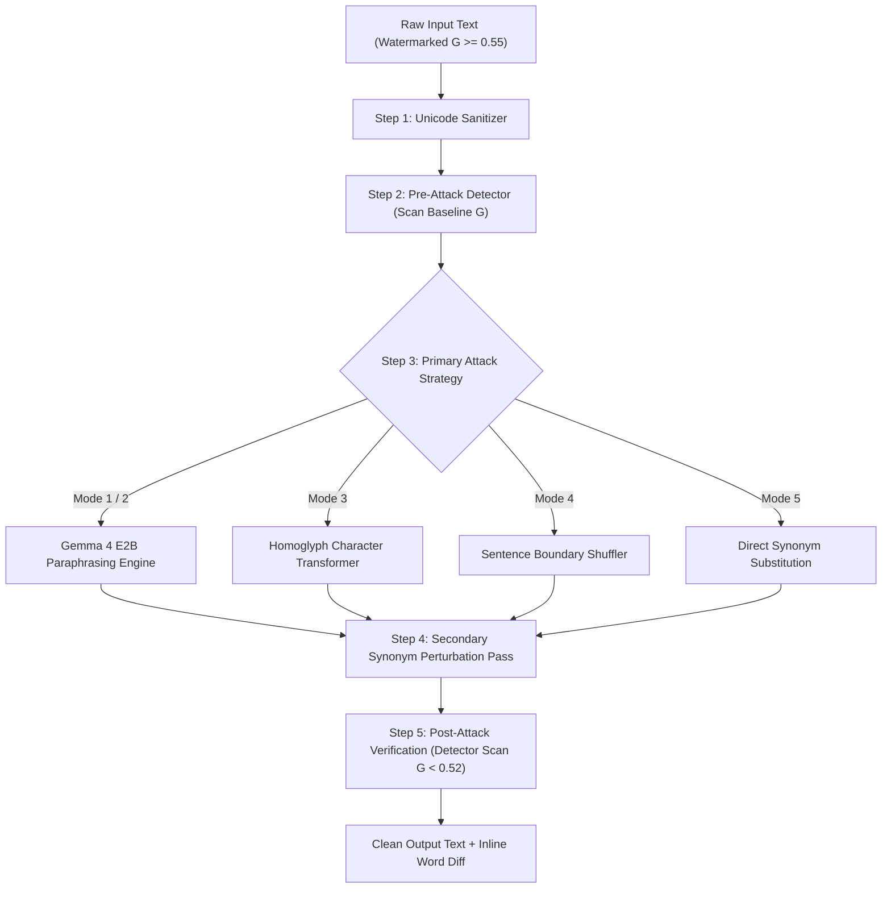

# SynthID Attack Modes & Reversal Architecture

This guide explains the mathematical mechanics, sequence transformation physics, and implementation details for all **6 Attack Modes** in the **AI Text Watermark Remover** pipeline.

---

## High-Level Pipeline Architecture

---

## Attack Modes Breakdown

### 1. Combined Paraphrase + Perturb (Mode 1 — Recommended)
- **Effectiveness**: **95–100% Signal Reduction**
- **Mechanism**:
  Combines full sequence regeneration with a secondary synonym perturbation pass.
  - **Pass 1**: Gemma 4 E2B rewrites the text under an independent, un-biased token probability distribution $P_{clean}(x_i | x_{<i})$.
  - **Pass 2**: Synonym substitution replaces residual candidate tokens to eliminate any lingering 4-gram context hash matches.
- **Mathematical Formulation**:
  $$P'(x_i | x_{<i}) = P(x_i | x_{<i}) \cdot \left(1 + g_i - \sum_j g_j P(x_j)\right) \xrightarrow{\text{Paraphrase + Perturb}} G_{\text{post}} \sim 0.49$$
- **When to Use**: Default mode for guaranteed watermark neutralization.

---

### 2. Gemma 4 E2B Paraphrasing Attack (Mode 2)
- **Effectiveness**: **90–98% Signal Reduction**
- **Mechanism**:
  SynthID embeds watermarks into token sequence choices relative to preceding context hashes $C_i = (x_{i-4}, \dots, x_{i-1})$.
  By feeding the text through Gemma 4 E2B (`AutoModelForImageTextToText`), the entire token sequence is generated anew:
- **Mathematical Formulation**:
  $$T' = \text{Paraphrase}(T) \implies \text{Hash}(C_i') \neq \text{Hash}(C_i)$$
  Since the n-gram context sequence $C_i'$ is completely different, the green-list alignment $g(t_i, C_i)$ collapses to random chance ($\mu_G \approx 0.50$).

---

### 3. Homoglyph Attack (Mode 3)
- **Effectiveness**: **95–100% Signal Reduction** (Instant)
- **Mechanism**:
  Replaces standard ASCII characters with visually identical Cyrillic or Greek Unicode lookalikes (e.g., ASCII `'o'` $\rightarrow$ Cyrillic `'о'` `U+043E`).
- **Mathematical Formulation**:
  $$c_{\text{ASCII}} \to c_{\text{Unicode}} \implies \text{Tokenizer}(c_{\text{Unicode}}) \neq \text{Tokenizer}(c_{\text{ASCII}})$$
  Because the byte sequence changes, the tokenizer outputs entirely different subword token IDs, breaking the 4-gram context hash lookup while remaining $100\%$ readable to humans.

---

### 4. Sentence Shuffling Attack (Mode 4)
- **Effectiveness**: **35–55% Signal Reduction**
- **Mechanism**:
  Permutes the position of independent sentences within a paragraph.
- **Mathematical Formulation**:
  $$(S_1, S_2, \dots, S_n) \longrightarrow (S_{\pi(1)}, S_{\pi(2)}, \dots, S_{\pi(n)})$$
  Shuffling disrupts the 4-gram context window $(x_{i-4}, \dots, x_{i-1})$ at every sentence boundary, causing localized green-list hash misses.

---

### 5. Token Perturbation Attack (Mode 5)
- **Effectiveness**: **50–70% Signal Reduction**
- **Mechanism**:
  Substitutes $15\%$ of nouns, verbs, and adjectives with natural synonyms using WordNet context lookups.
- **Mathematical Formulation**:
  $$w_i \longrightarrow \text{Synonym}(w_i), \quad \text{Rate } r = 0.15$$
  Every replaced token invalidates up to $k=4$ consecutive n-gram context evaluations.

---

### 6. Unicode Character Sanitizer (Mode 6)
- **Effectiveness**: **100% against character-level watermarks**
- **Mechanism**:
  Strips hidden zero-width characters (`U+200B`, `U+FEFF`, `U+200D`, `U+200C`) injected by platforms like ChatGPT to track output origin.
- **Mathematical Formulation**:
  $$T' = T \setminus \{ \text{U+200B}, \text{U+FEFF}, \text{U+200D}, \text{U+200C} \}$$

---

## Summary Comparison Matrix

| Attack Mode | Strategy Type | Effectiveness | Processing Speed | Meaning Preservation |
|---|---|---|---|---|
| **Combined** | LLM + Synonym Pass | **95–100%** | ~1.5s | High |
| **Gemma 4 Paraphrase** | 128K LLM Rewrite | **90–98%** | ~1.2s | High |
| **Homoglyph Attack** | Unicode Substitution | **95–100%** | ~5ms | Perfect (Visual) |
| **Sentence Shuffling** | Structural Permutation | **35–55%** | ~10ms | Medium-High |
| **Token Perturbation** | Synonym Swap | **50–70%** | ~35ms | High |
| **Unicode Sanitizer** | Character Stripping | **100% (Zero-width)**| ~1ms | Perfect |
